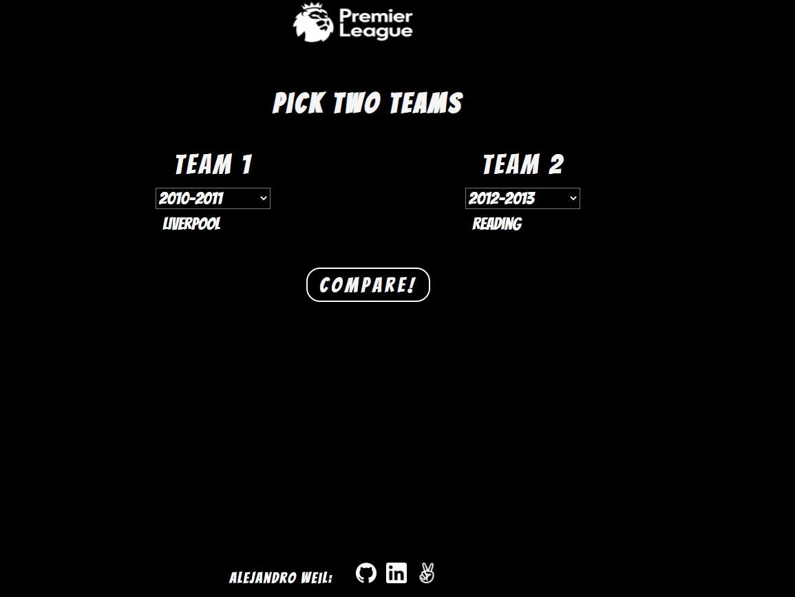

# EPLTeamComparison

# [<p align="center"></p>][1]

### Background
* I'm a big fan of the english premier league(EPL) and have always been curious as to how the game has changed over the years. I wanted to create a website where users can compare two teams from any year in which they participated in the EPL. A lot of websites have team comparison graphs and charts but I have yet to find one that compares teams across different years. 

### High Level Overview
* The EPL Team Comparison renders data by season for two individual teams selected by team name and by season of the EPL. Users will select two teams by name and then by season of EPL in which the teams participated in, can be different years by the teams. Site will render a graph displaying a comparison of the teams in key stats such as points, goals scored, goals against, goals per minute, yellow cards, red cards, etc.

### Users will be able to:
* Search for specific teams that have at least one year participated in EPL(2009-2019 seasons).
* Sort the team selected by specific season(year).
* Do the same for a second team to compare against first team selected.
* View data rendered and debate which team is the best/worst/middling of the entire existence of the EPL.

## Architecture and Technology
* Vanilla Javascript for most code structure and creating search bar.
* D3 library for rendering statistics in desired format( Bar + Line Graphs).
* D3 and JS to grab stats from csv data files and sort them into desired format/organization to render.
* Webpack to bundle scripts into a single source.

## MVP and Features

### Search Feature
EPL Team Comparison allows users to select a season(2009-2019) and then generates a list of teams from the season selected dynamically for the user to select. This is done using a combination of vanilla JS for DOM manipulation, and D3 for selection of elements and for generating lists of teams based on season selected.

<p align="center"></p>

```js

  // select menus for seasons
    const teamOneSeasonSelector = document.querySelector("select.team1-season")
    const teamTwoSeasonSelector = document.querySelector("select.team2-season");

    // select menus for teams
    const firstTeamSelector = document.querySelector("select.team1-name");
    const secondTeamSelector = document.querySelector("select.team2-name");

    // on change selector events to populate team names
    teamOneSeasonSelector.onchange = (event) => {
      const season = event.target.value;
      removeTeamsFromSearch(".team1-name");
      populateTeamSelector(season, "team1-name");
    }
    
    teamTwoSeasonSelector.onchange = (event) => {
      const season = event.target.value;
      removeTeamsFromSearch(".team2-name");
      populateTeamSelector(season, "team2-name");
    }
    
    // function to populate team selectors for each season
  const populateTeamSelector = (season, selector) => {
   const teams = [];
   d3.csv(`https://raw.githubusercontent.com/aweil13/EPLTeamComparison/main/data/${season}.csv`).then(data => {
        for (let i = 0; i < data.length; i++) {
          const matchday = data[i];
          if (!teams.includes(matchday["HomeTeam"])){
              teams.push(matchday["HomeTeam"]);
          } else if (!teams.includes(matchday["AwayTeam"])) {
             teams.push(matchday["AwayTeam"]);
          }
        }
        const dropDownTeam = d3.select(`.${selector}`);
        dropDownTeam.selectAll('dataOptions')
        .data(teams)
        .enter()
        .append('option')
        .text(d => {return d})
        .attr("value", d => {return d})
        .attr("label", d => {return d});
   })
}

// function to remove options from select dropdown
const removeTeamsFromSearch = element => {
    d3.select(element).selectChildren("option").remove();
}
```
### Data Visualization
EPL Team Comparison allows users to compare different teams across premier league seasons using 12 key statistics (Points, Goals, First Half Goals, Second Half Goals, Fouls Against, etc). This is done by visualizing the statistics over each match incrementally(Line Graph), and totals(Bar Graph). Data is generated based on user selection. Data is extracted from csv files using D3 and then organized using JS and individual classes for each graph type. Users can seamlessly transition between data output types and between statistics they want outputted using a combination of D3 and JS.     

<p align="center"></p>

```js
 // Compare button which generates graphs based on queried selections
    compareButton.on("click", function(d) {
        resetButton(searchForm);
        searchForm.style.display = "none";
        
        TEAMS["team1"] = firstTeamSelector.value;
        TEAMS["team2"] = secondTeamSelector.value;
        SEASONS["season1"] = teamOneSeasonSelector.value;
        SEASONS["season2"] = teamTwoSeasonSelector.value;

        if (TEAMS["team1"] === TEAMS["team2"] && SEASONS["season1"] === SEASONS["season2"]){
            alert("Please select different seasons if you wish to compare the same club!");
            d3.select('.reset-button-container').selectChildren('button').remove();
            searchForm.style.display = "block";
        } else if (TEAMS["team1"] === "" || TEAMS['team2'] === ""){
            alert("Please select two Teams!");
            d3.select('.reset-button-container').selectChildren('button').remove();
            searchForm.style.display = "block";
        } else {
          createLineGraph(TEAMS["team1"], SEASONS["season1"], TEAMS["team2"], SEASONS["season2"]);
          populateLogos(TEAMS["team1"], TEAMS["team2"]);
      }
    })
    

     // Dropdown button used for switching between statistics based on option selected
          let that = this;
          dropDownButton.on("change", function(d) {
            let selectedOption = d3.select(this).property("value");
            switch (selectedOption) {
              case "Points":
                  that.update(that.seasonPointsTeamOne, that.seasonPointsTeamTwo, selectedOption, x, xAxis, y, yAxis);    
                  break;
              case "Shots":
                  that.update(that.seasonShotsTeamOne, that.seasonShotsTeamTwo, selectedOption, x, xAxis, y, yAxis);
                  break;

    // function to change graph to either line graph or bar graph
const changeGraphButton = () => {
    d3.select(".change-graph-type-container").selectChildren("button").remove();
    removeUpdateButton();

    if (GRAPH.line === true && GRAPH.bar === false){
      d3.select(".change-graph-type-container")
      .append("button")
      .attr("class", "change-graph-button")
      .text("Bar Graph")
      .on("click", function(d){
        createBarGraph(TEAMS.team1, SEASONS.season1, TEAMS.team2, SEASONS.season2);
      })
    } else if (GRAPH.bar === true && GRAPH.line === false){
      d3.select(".change-graph-type-container")
      .append("button")
      .attr("class", "change-graph-button")
      .text("Line Graph")
      .on("click", function(d){
        createLineGraph(TEAMS.team1, SEASONS.season1, TEAMS.team2, SEASONS.season2);
    })}
}
```

## Dataset
* [Datahub.io EPL Data][2]


## Implementation Timeline
* Day 1: Learn D3 library and figure out how to render data using it.
* Day 2: Implement data obtained from http://www.football-data.co.uk/englandm.php intp rendering using D3.
* Day 3: Comparison graph and how to pick 2 teams based on user input.
* Day 4: Search Function.
* Day 5: Finishing touches.


[1]: https://aweil13.github.io/EPLTeamComparison/
[2]: https://datahub.io/sports-data/english-premier-league